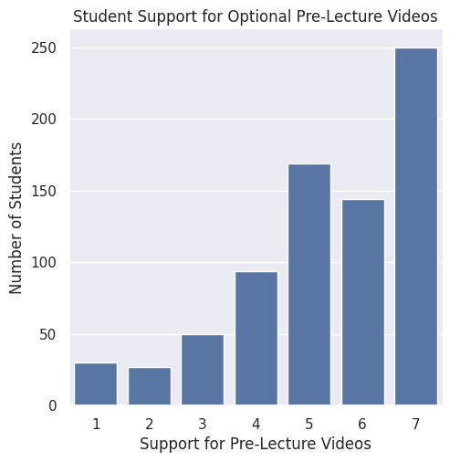
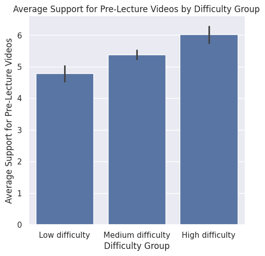
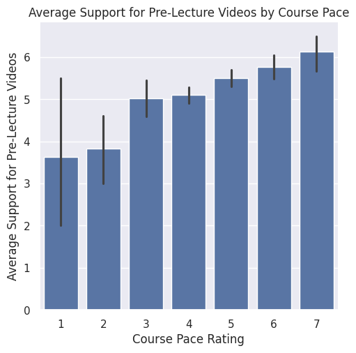

---
# Do not edit the text between these lines!
layout: default
---

# COMP110 Data Analysis Project

## Project Summary

For my project, I analyzed whether COMP110 should add short optional pre-class videos. My idea was that these videos could help students prepare before lecture, especially if they feel the course is difficult or moving quickly.

To explore this idea, I used the course survey data and focused on student responses about support for pre-class videos, course difficulty, and course pace. I first combined the two survey datasets, selected the columns that were relevant to my question, and then used a helper function to group students by how difficult they found the course. After that, I created charts to compare support for pre-class videos with difficulty and pace.

## Student Support for Pre-Class Videos

The first chart shows how students rated their support for optional pre-class videos. Most students gave higher ratings, especially between 5 and 7. This suggests that many students would be interested in this kind of resource.

## Support by Difficulty Group

The second chart compares support for pre-class videos across low, medium, and high difficulty groups. Students who rated the course as more difficult tended to show higher average support for pre-class videos. This supports the idea that students who are having more trouble in the course may benefit from extra preparation before lecture.

## Support by Course Pace

The third chart compares course pace ratings with average support for pre-class videos. The graph shows a general rise in support as students rated the course pace higher. This suggests that students who feel the class moves quickly may be more interested in having pre-class videos available.

## Conclusion

Based on the graphs generated, the data suggests that pre-class videos have support from most of the students that took the survey. This is evident in the first graph showing how a large majority of students chose a level 5-7, the highest level of support for pre-class videos. Additionally, the second graph communicates that the more difficult someone rated the class, the higher, on average, they supported the introduction of pre-class videos. The final graph shows a general rise in average support for pre-class videos as students rated the course pace rating higher. All of this is to say that there is general support for pre-class videos and that support is greater from students who have more trouble succeeding.